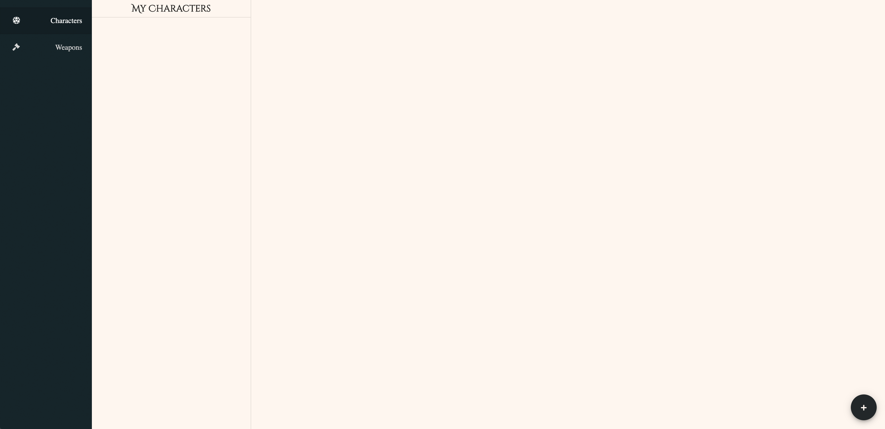
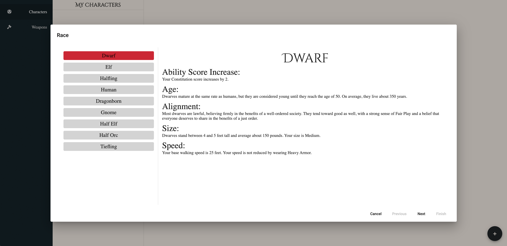
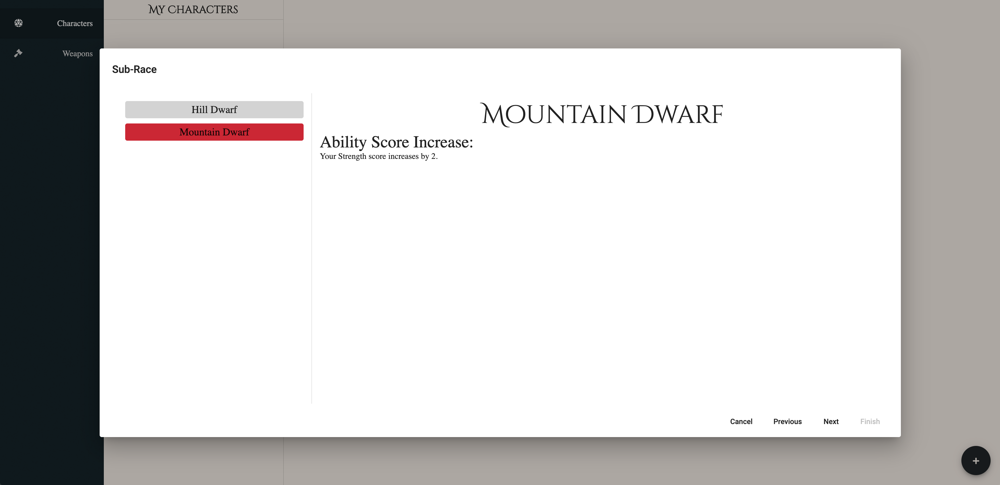
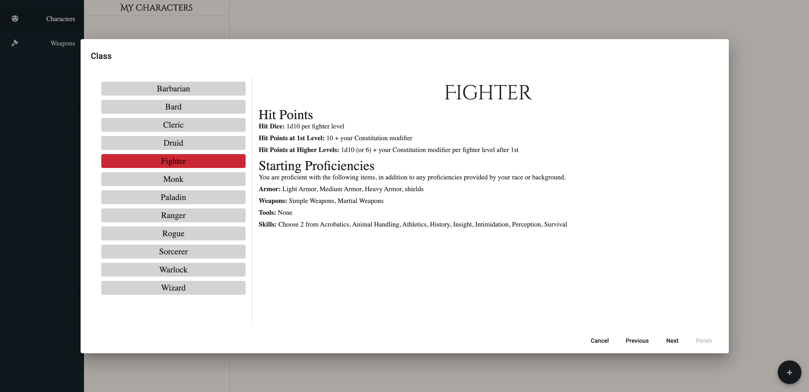
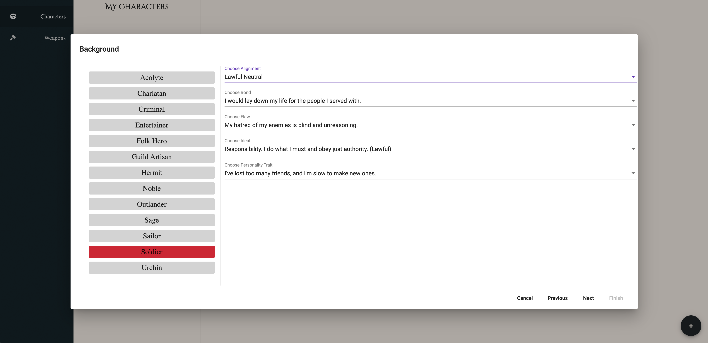
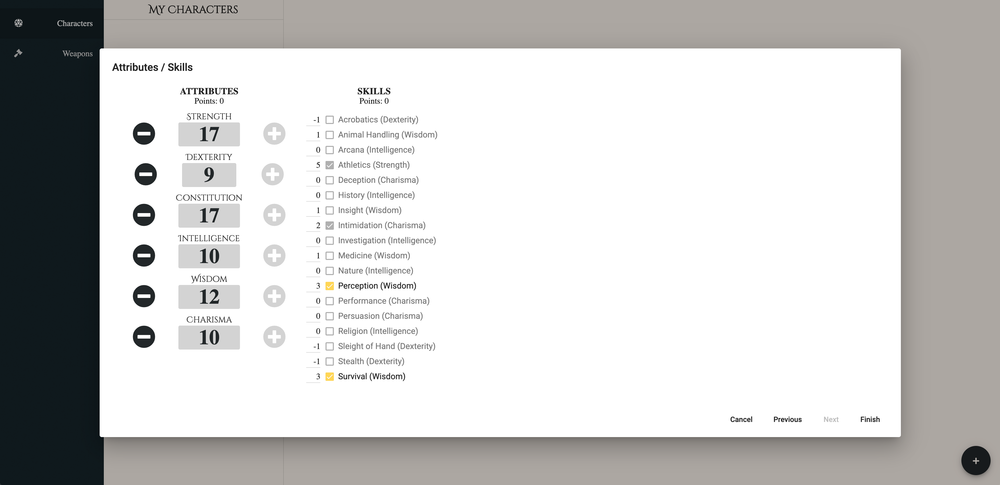
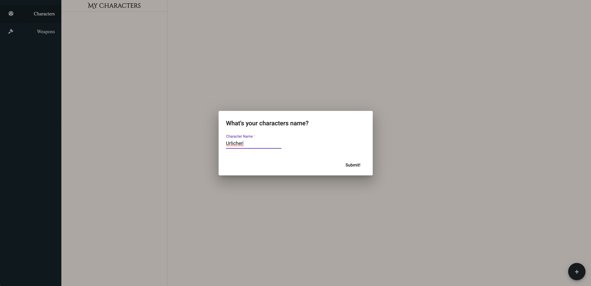
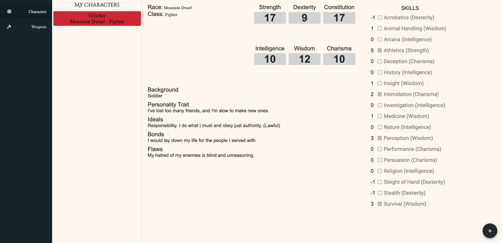
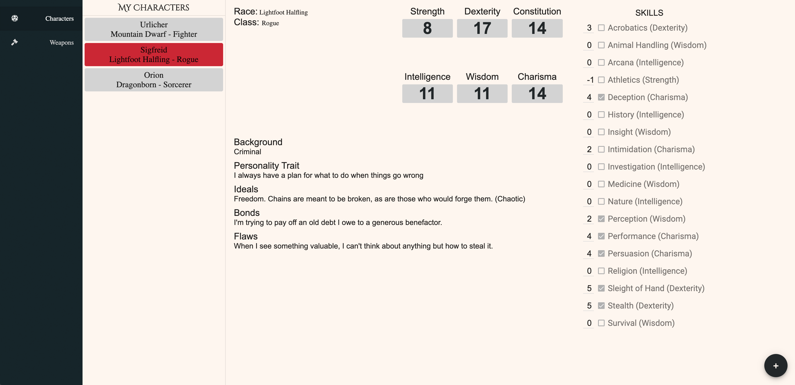

# ProjectDegenerate

D&amp;D Weapon Generator & Character Creator

This is a weapon generator for any game master looking for some magical loot. As well as a character creator to help players easily build characters

## How to run this app

First to run this app you will need [npm](https://www.npmjs.com/get-npm) and [git](https://git-scm.com/downloads) (unless you download the [zip](https://github.com/VictorMatthews/project-degenerate/archive/master.zip) from GitHub) 

Clone this repo with git by running `git clone https://github.com/VictorMatthews/project-degenerate.git`

Open that directory in your terminal and run `npm install` followed by `npm start`

From there all you have to do is open a browser and navigate to [localhost:4200](http://localhost:4200/)

Next you can choose character creation or weapon creation from the menu.

